# 🚀 Budget Management Monitoring Indicators in Odoo Version 13

## This project aims to design and implement relevant indicators that allow effective monitoring of budget management, in line with performance objectives and financial control requirements.

## 📸 Screenshots

### 🖥️ Dashboard

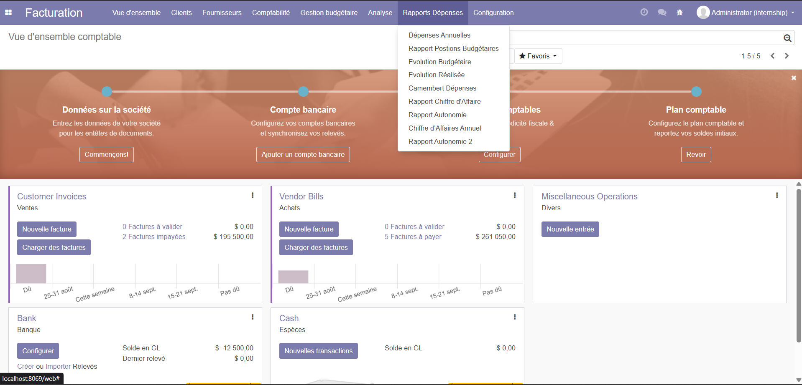

---

### 📊 Report 1

- Wizard  
  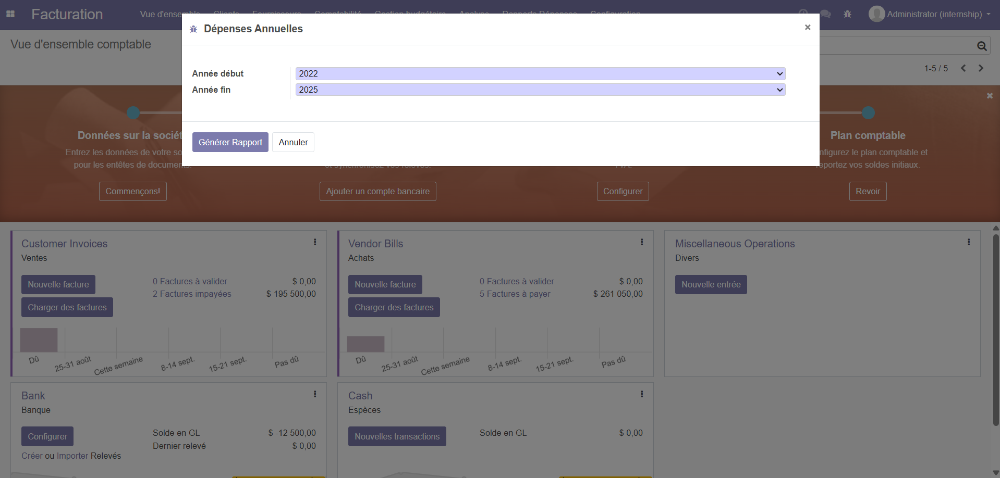
- Pivot View  
  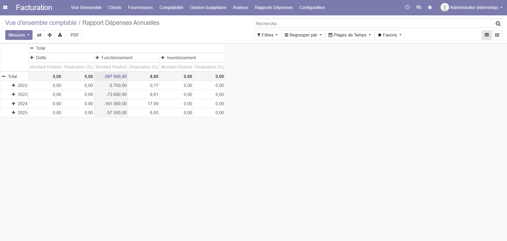

---

### 📊 Report 2

- Wizard  
  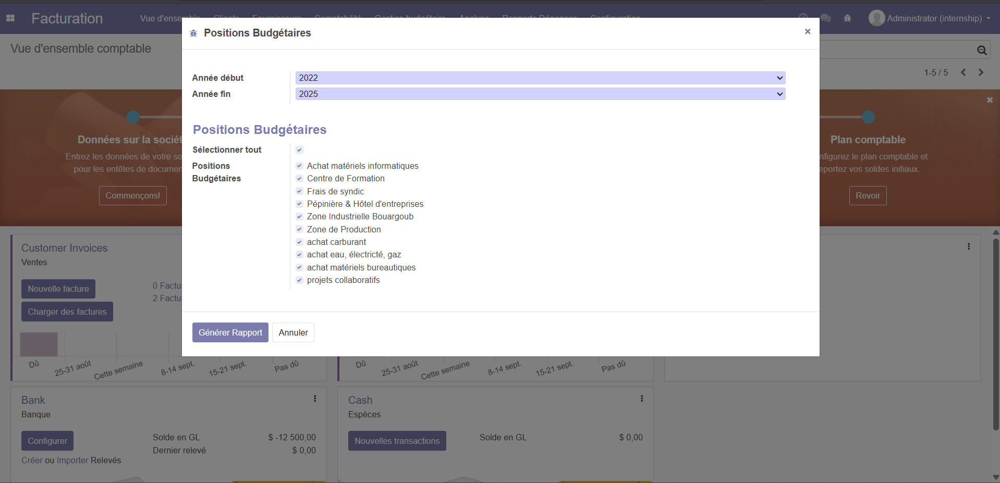
- Pivot View  
  
- PDF Export  
  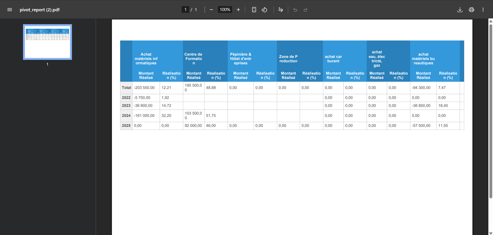
- XLS Export  
  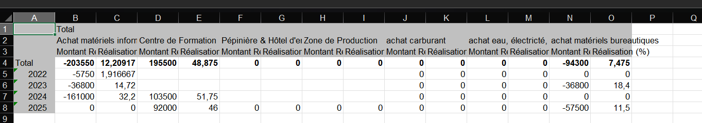

---

### 📊 Report 3

- Wizard  
  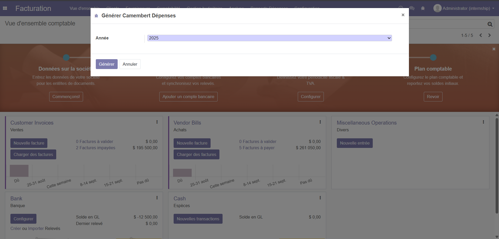
- Graph  
  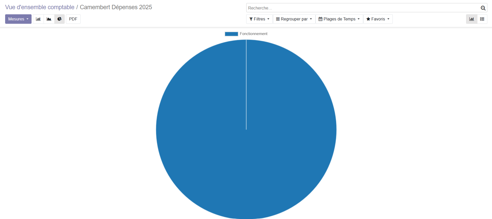

---

### 📊 Report 4

- Wizard  
  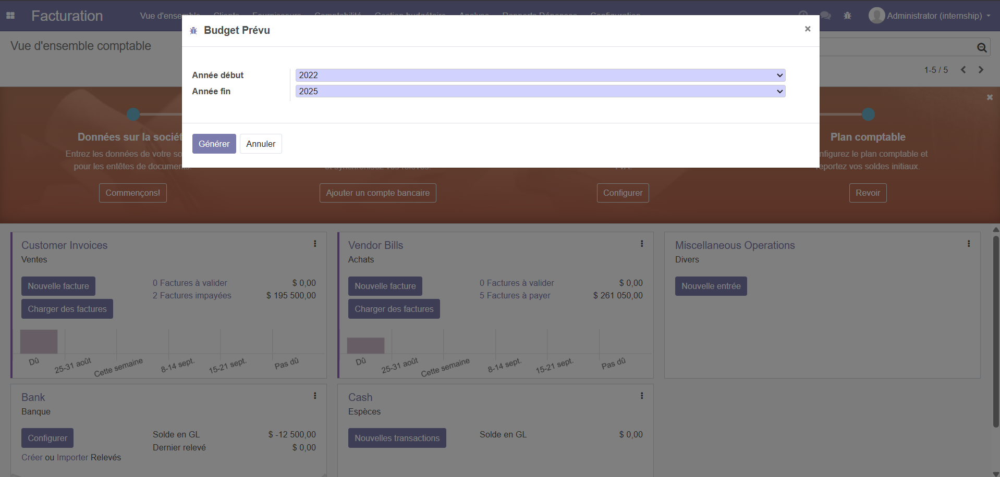
- Graph  
  

---

### 📊 Report 5

- Wizard  
  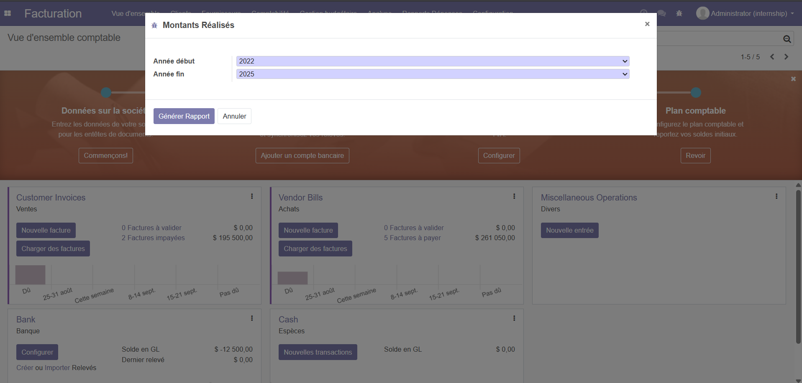
- Graph  
  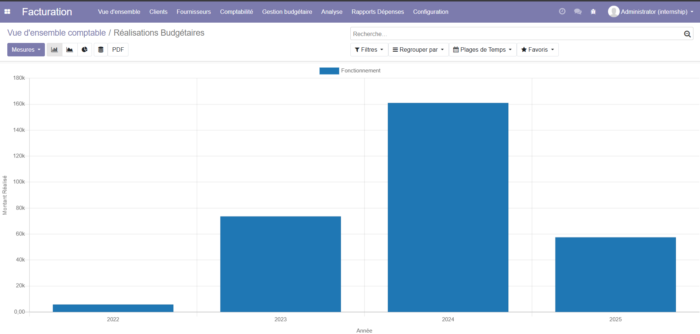

---

### 📊 Report 6

- Wizard  
  
- Pivot View  
  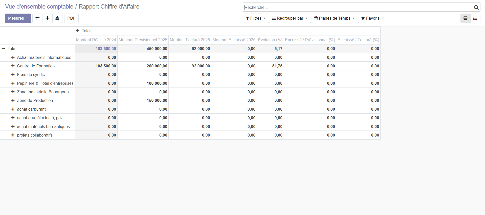

---

### 📊 Report 7 (Method 1)

- Wizard  
  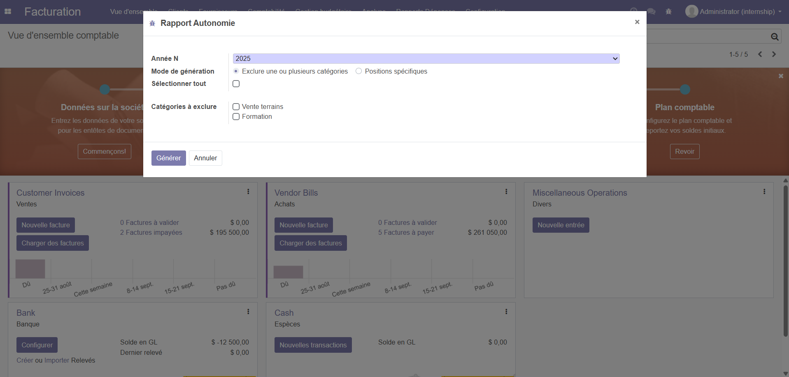
- Pivot View  
  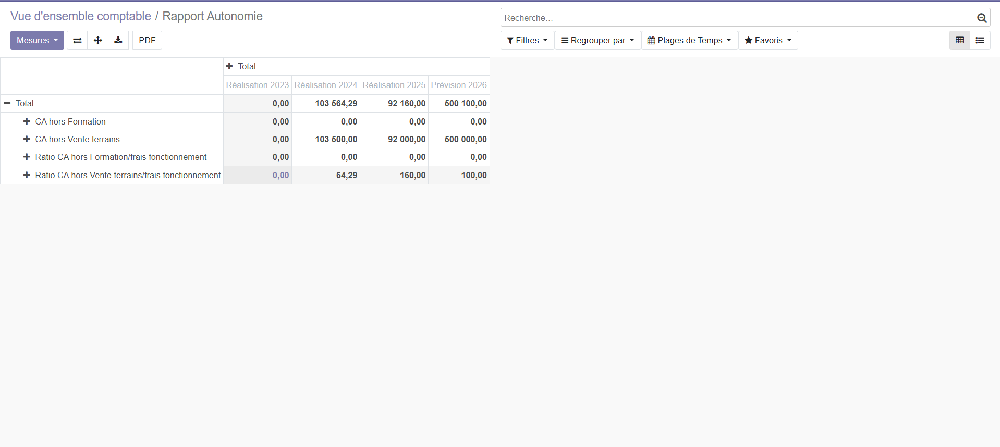

---

### 📊 Report 7 (Method 2)

- Wizard  
  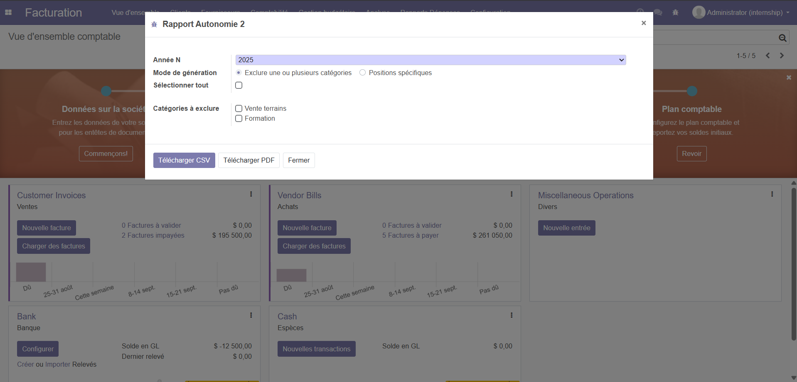
- PDF Export  
  
- XLS Export  
  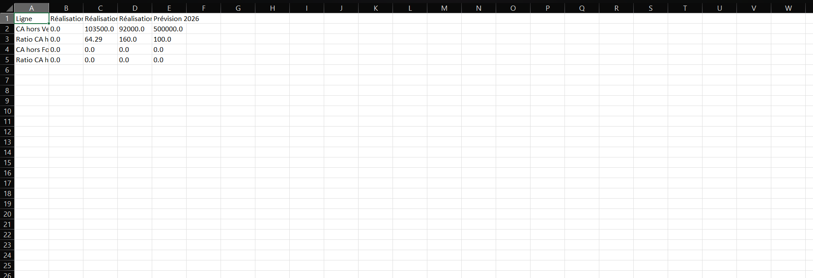

---

### 📊 Report 8

- Wizard  
  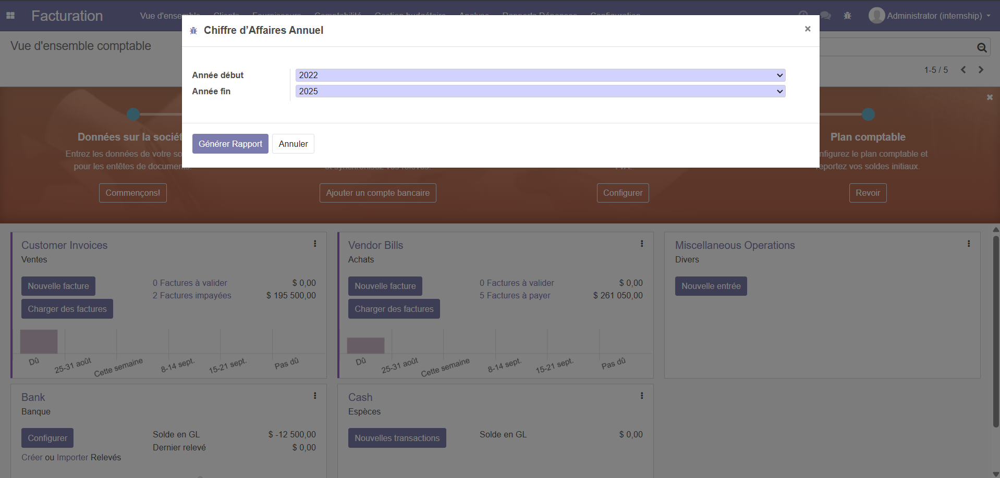
- Graph  
  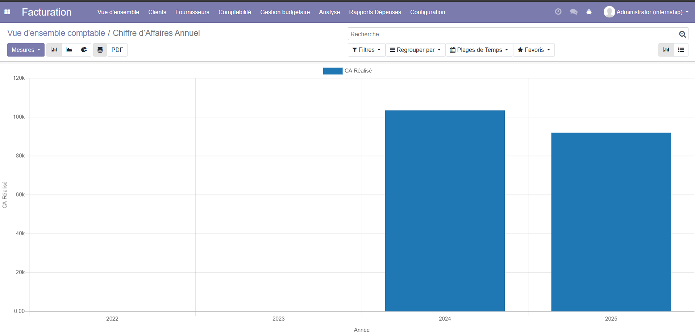

---

## 🛠️ Technologies Used

- **Backend:** Odoo 13, Python 3.7.9
- **Database:** PostgreSQL 13.21

---

## ⚙️ Installation

### 1️⃣ Clone the repository

```bash
git clone https://github.com/taha3313/odoo-gestion-budgetaire.git
cd pfa-odoo-2025
```

### 2️⃣ Copy the modules into Odoo `custom_addons` directory

```bash
cp -r pfa-odoo-2025/* /odoo/custom_addons/
```

---

## 💾 Database Restoration

Inside the project folder `pfa-odoo-2025/`, you will find two database dump files:

- **`odoo_db_empty.sql`** → An empty database with only the base configuration.
- **`odoo_db_full.sql`** → A full database containing demo data and reports.

### 🔹 Restore the empty database

```bash
createdb internship_empty
psql -U odoo -d internship_empty -f pfa-odoo-2025/odoo_db_empty.sql
```

### 🔹 Restore the full database

```bash
createdb internship_full
psql -U odoo -d internship_full -f pfa-odoo-2025/odoo_db_full.sql
```

> ⚠️ Make sure PostgreSQL is running and your user (`odoo` in this example) has permission to restore databases.  
> You can rename the databases (`internship_empty` / `internship_full`) as you like.

---

## ▶️ Running Odoo

### 3️⃣ Restart Odoo server

```bash
./odoo-bin -c /etc/odoo.conf -u all
```

### 4️⃣ Activate Developer Mode

- Open: **http://localhost:8069/web?debug=assets**

### 5️⃣ Install the modules

- Go to **Apps**
- Update the apps list
- Search and install:
  - `om_account_budget`
  - `ccit_groups_config`
  - `web_pivot_hide_total`

---

## ✅ Usage

After installation, you can access the reports from:  
**`Facturation → Rapports Dépenses`** in Odoo.

Each wizard provides options to export data in different formats, including **Pivot Tables, Graphs, PDF, and Excel**.

---
